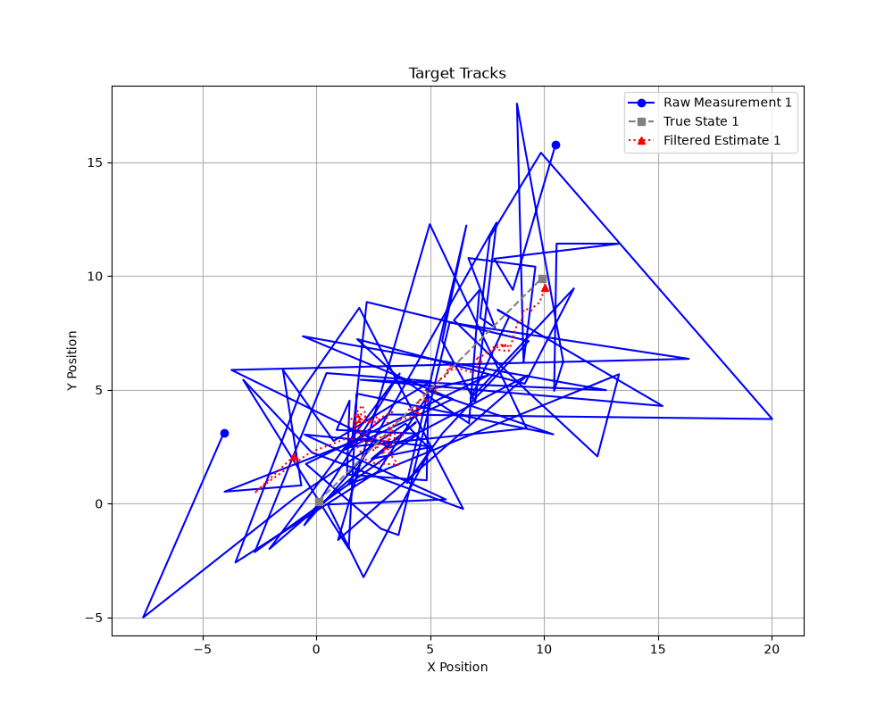
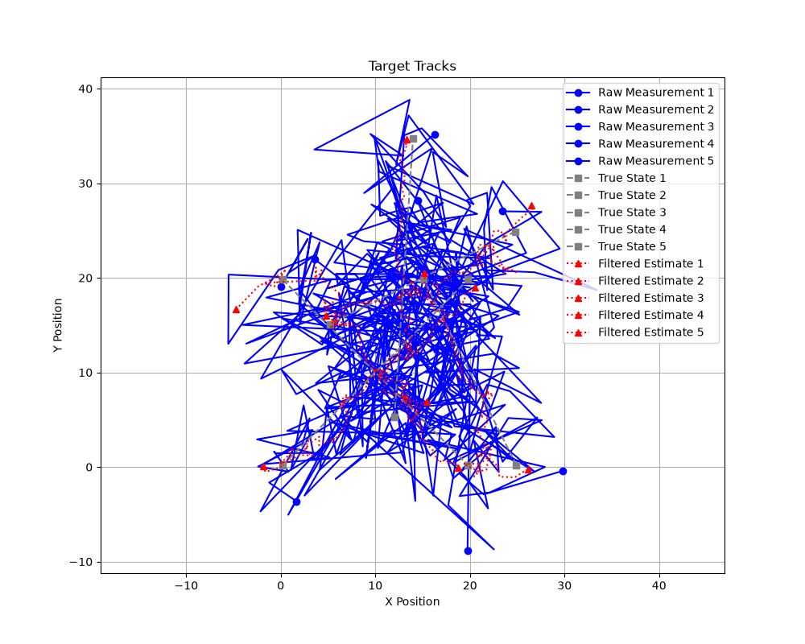
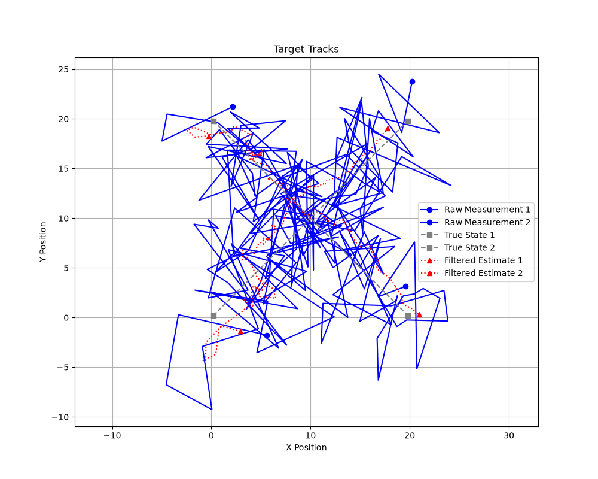
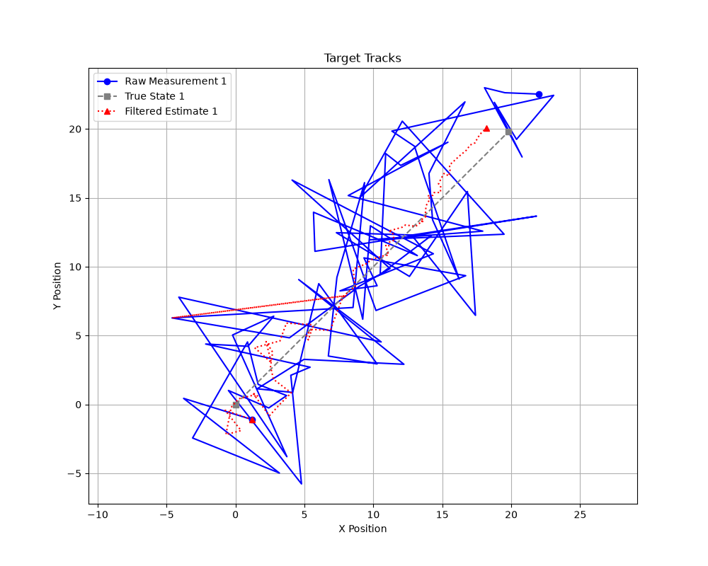
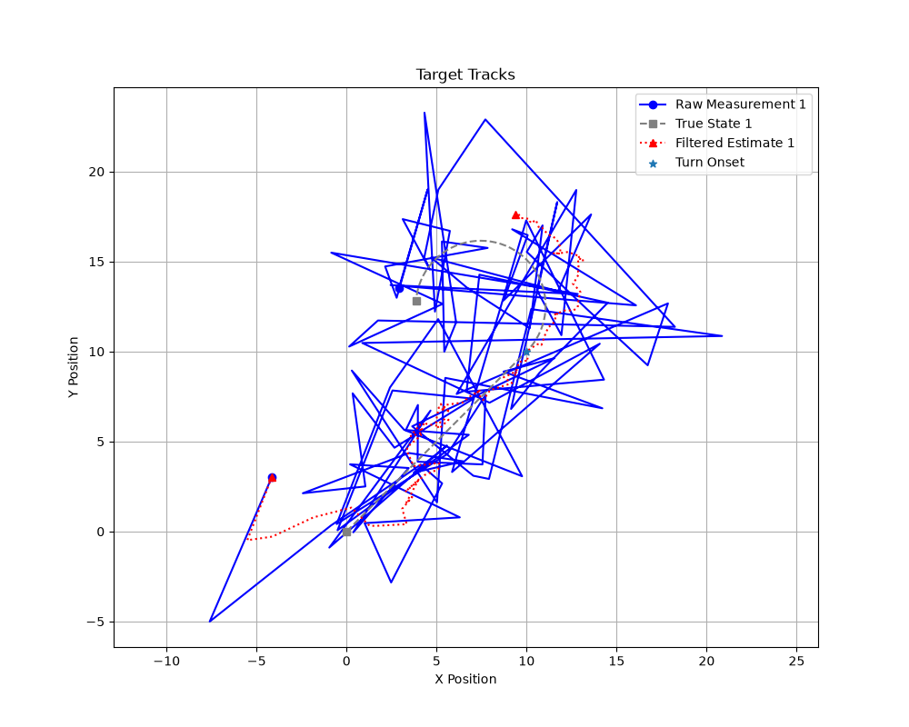
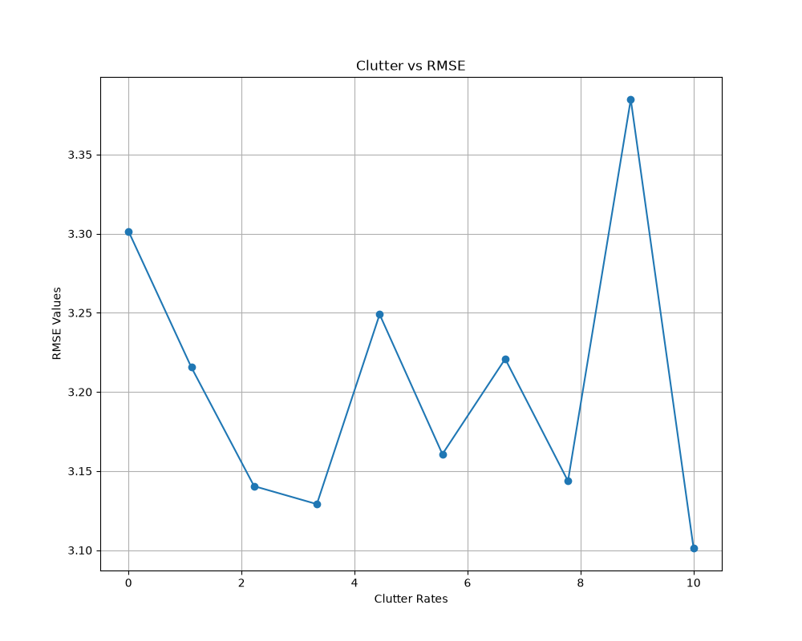
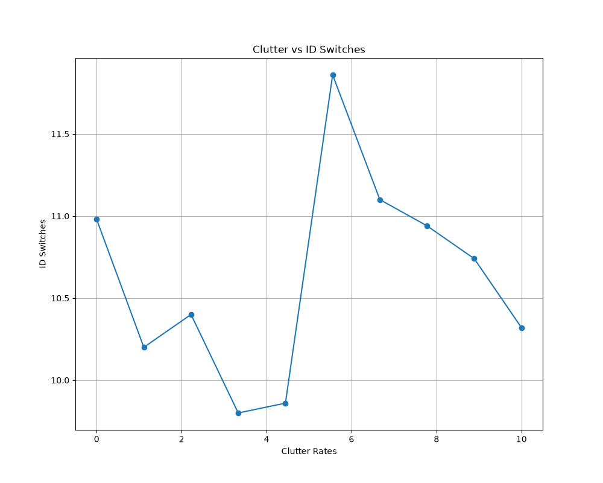
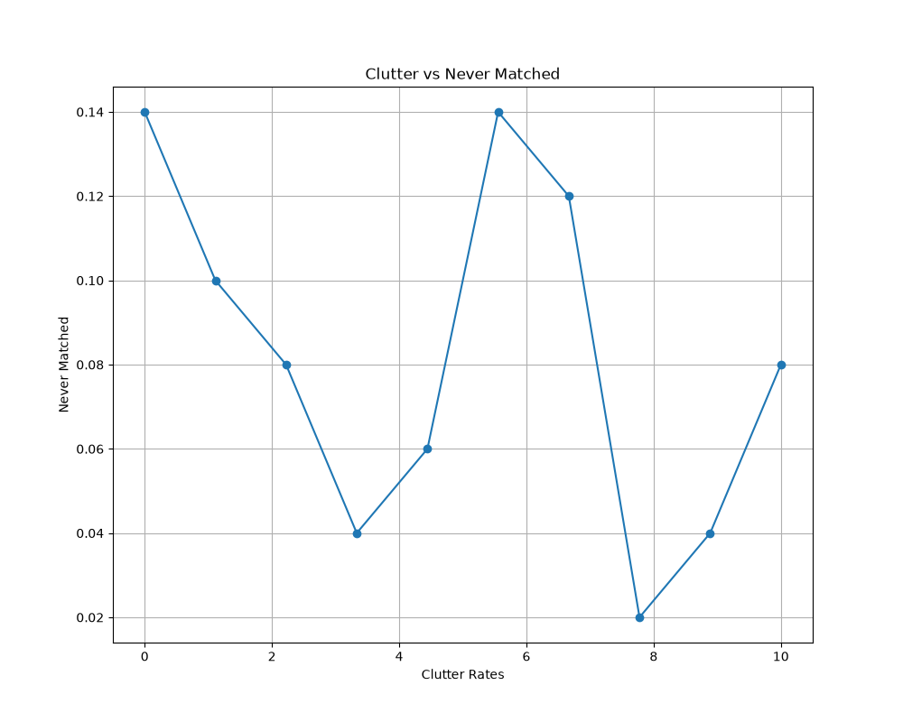

# Multi-Target Kalman Filter Tracker

This project entails a multi-target tracking system. It includes a Kalman filter estimator using the
Hungarian-algorithm for data association. This README includes the project structure as well as the results. This project will also serve as a baseline for a future project that implements unscented and extended Kalman filters for nonlinear sensor fusion (radar + eo/ir signals).

## Features

- Kalman filter core (`predict`/`update`) with `MotionModel`/`MeasurementModel`
- Chi-squared gating + Hungarian assignment for data association
- Track lifecycle includes birth, confirmation, and death under missed detections and Poisson-distributed clutter
- To highlight the constant-velocity filter's limits a maneuvering-target scenario is included
- Randomized multi-target scenarios are implemented through a Monte Carlo sweep infrastructure (scored through RMSE, ID-switch, and track-loss curves)

## Project Structure

```
target_tracker/
├── README.md
├── LICENSE
├── pyproject.toml
├── pytest.ini
├── requirements.txt
├── configs/
│   └── default.yaml              # baseline tuning parameters (noise, gating, lifecycle, etc.)
├── scripts/
│   ├── run_demo.py               # Single target w/ Gaussian measurement noise
│   ├── run_demo_multi.py         # Five targets w/ cheated association
│   ├── run_demo_crossing.py      # Two targets crossing w/ real association
│   ├── run_demo_clutter.py       # Missed detections and clutter
│   ├── run_demo_maneuver.py      # Coordinated turn w/ visible filter lag
│   └── run_sweep.py              # Monte Carlo sweep over different clutter rates
├── src/tracking/
│   ├── __init__.py
│   ├── types.py                  # Detection, TrackSnapshot, FrameResult dataclasses
│   ├── models/
│   │   ├── __init__.py
│   │   ├── motion.py             # MotionModel ABC, ConstantVelocity2D
│   │   └── measurement.py        # MeasurementModel ABC, LinearPosition2D
│   ├── filters/
│   │   ├── __init__.py
│   │   ├── base.py               # BayesFilter ABC
│   │   ├── kalman.py             # KalmanFilter
│   │   └── utils.py              # wrap_angle, residual_with_angles (for later projects)
│   ├── association/
│   │   ├── __init__.py
│   │   ├── gating.py             # mahalanobis_sq, chi2_gate_threshold, build_cost_matrix
│   │   └── assignment.py         # hungarian_assign
│   ├── tracker/
│   │   ├── __init__.py
│   │   ├── track.py              # Track (hit/miss/confirm/death lifecycle)
│   │   └── manager.py            # MultiTargetTracker
│   ├── sim/
│   │   ├── __init__.py
│   │   ├── trajectories.py       # ground-truth motion generators (CV, coordinated turn)
│   │   ├── sensors.py            # Sensor ABC, PositionSensor (noise, misses, clutter)
│   │   └── scenario.py           # Scenario dataclass, build_scenario()
│   └── eval/
│       ├── __init__.py
│       ├── metrics.py            # position_rmse, nees, count_id_switches, match_tracks_to_truth, etc.
│       └── viz.py                # plot_tracks, plot_sweep_curve
└── tests/
    ├── test_kalman.py
    ├── test_association.py
    ├── test_metrics.py
    └── test_sim.py
```

## Setup

```bash
python3 -m venv .venv
source .venv/bin/activate
pip install -r requirements.txt
```

Or, as an installable package:

```bash
pip install -e .          # editable install, for development
pip install git+https://github.com/colesjunge/multiTargetKalmanFilterTracker.git  # or install directly from GitHub
```

## Usage

Each script is runnable standalone once dependencies are installed:

| Script | What it demonstrates |
|---|---|
| `scripts/run_demo.py` | Single target w/ Gaussian measurement noise (raw vs. filtered vs. truth) |
| `scripts/run_demo_multi.py` | Five targets w/ cheated association |
| `scripts/run_demo_crossing.py` | Two targets crossing w/ real association (gating and Hungarian association) |
| `scripts/run_demo_clutter.py` | Track lifecycle under noise (missed detections and Poisson distributed clutter) |
| `scripts/run_demo_maneuver.py` | Coordinated turn w/ visible filter lag (showcases limitations of CV Kalman filter) |
| `scripts/run_sweep.py` | Monte Carlo sweep over different clutter rates (RMSE, ID-switch, track-loss curves vs. clutter rate) |

```bash
python scripts/run_demo.py
```

Figures are written to `figures/` (gitignored so regenerate by rerunning the scripts).

## Running tests

```bash
pytest -v               # full suite
pytest tests/test_kalman.py -v   # a single file
```

`pytest.ini` adds `src/` to the path, so no separate install step is needed.

## Results

This project was built in stages, as organized by the results below.

### Stage 1 (Single Target w/ exact measurements)

The Kalman filter was initially tested with exact measurements to ensure that it accurately converges to the true position from a deliberately wrong initial state. The final position error (~1e-14) and velocity error (~1e-15) confirmed the implementation with the covariance shrinking monotonically and stabilizing (trace(P) ≈ 8e-14) after 100 steps.

### Stage 2 (Single Target w/ Gaussian measurement noise)

In this stage, Gaussian noise was introduced to the measurements. To compare the filter to the raw measurements, the RMSE for each against the ground truth trajectory was calculated. The filtered RMSE was meaningfully below the raw RMSE (~1.45 < ~5.03 respectively).



Run via `python scripts/run_demo.py`.

### Stage 3 (Filter consistency across trials)

To check whether the filter was consistent over multiple trials, the average NEES was calculated across a Monte Carlo simulation of 100 runs. This value (~3.6) was close to the state dimension (4; x, y, vx, vy), and thus the filter was accurately calibrated and statistically consistent.

### Stage 4 (Five independently tracked targets)

This stage tests whether the `MultiTargetTracker` can accurately handle five independent targets. Here the association is cheated, with the data assignments given rather than solved. The filtered RMSE (~1.30–1.81) beat the raw RMSE (~5.06–6.59) across all five targets.



Run via `python scripts/run_demo_multi.py`. 

### Stage 5 (Two targets crossing paths w/ real association)

Real association was implemented in this stage using chi-squared gating and Hungarian assignment to solve the cost matrix. To test this, the filter was verified on two crossing paths (Target A and B), with the track IDs surviving. The filtered RMSE was below the raw RMSE for both A (~2.65 < ~5.38) and B (~1.52 < ~4.97). 



Run via `python scripts/run_demo_crossing.py`.

### Stage 6 (One target tracked through missed detections and clutter)

This stage implemented `clutter_rate` within `PositionSensor`, which is Poisson-distributed. Missed detections are also implemented through `p_detect`. This was verified on one target with `p_detect=0.8` and `clutter_rate=1.0` over 100 frames. No clutter points were ever confirmed as tracks and the target track survived detection gaps. The filtered RMSE was also well below the raw RMSE (~2.15 < ~5.26). It should be noted however that although this run is seeded, these results will vary by nature of `clutter_rate` and `p_detect`.



Run via `python scripts/run_demo_clutter.py`.

### Stage 7 (A maneuvering target w/ visible filter lag)

In this stage a maneuver was introduced through `coordinated_turn_trajectory()`, with the filter still running constant velocity. The demo entails the target flying straight and then executing a ~225° turn. The goal of this stage was to visualize the lag, with this behavior being the baseline for a future project. The filtered and raw RMSEs were calculated for the total track as well as each leg. The turn leg filtered RMSE (~4.41) was more than double the straight leg filtered RMSE (~1.86). The peak position error (~7.29 m) was on the very last frame, meaning the lag never recovers on its own. This was expected as `Q=0`, meaning that no uncertainty is re-admitted once the filter has converged. 

One notable finding was the consequence of the tracker's `gate_confidence` on this test. The default was set to .99, but this resulted in a very tight `P` over the course of the initial straight leg. Thus the association gate rejected the track mid turn, dropping and reforming it from scratch rather than showing the continuous lag. Raising this parameter to .999 allowed the same track to survive the maneuver and reveal the underlying lag.



Run via `python scripts/run_demo_maneuver.py`.

### Stage 8 (Monte Carlo sweep over clutter rate)

For this final stage, the tracker was run across a Monte Carlo simulation of independently seeded trials. The simulation swept over `clutter_rate` (0, 1.11, 2.22, ... 7.78, 8.89, 10) with 50 trials, each with 10 targets. Overall, the three curves stay fairly flat (Filtered RMSE ~3.10-3.38 per trial; ID switches ~9.8-11.9 per trial; targets never matched ~0.02-0.14 per trial), showing that the tracker's parameters and gating apparatus hold up rather than degrading. 





Run via `python scripts/run_sweep.py`. 

## Limitations & Next Steps

- The motion model is constant-velocity only (`sigma_a=0.0` throughout)
- The measurement model is linear position-only, while real sensors (radar range/bearing, EO/IR bearing-only) are nonlinear.
- `angle_indices` and a `residual_with_angles` helper were added to the base `MeasurementModel`/`KalmanFilter` (not used in this project)
- The next project will build upon this and entail nonlinear sensor fusion with Extended/Unscented Kalman Filters across radar and EO/IR sensors

## On AI Assistance

I used Claude Code in this project explicitly as a debugging and testing guide. It did not write any code, but it was useful for reviewing and debugging files to ensure that all functions were correctly implemented and integrated. Rather than fixing issues, I had it explain their root causes, allowing me to make and learn the appropriate fixes myself. It was also used to expedite git commits/pushes.

## License

This project is licensed under the MIT License — see [LICENSE](LICENSE) for details.
